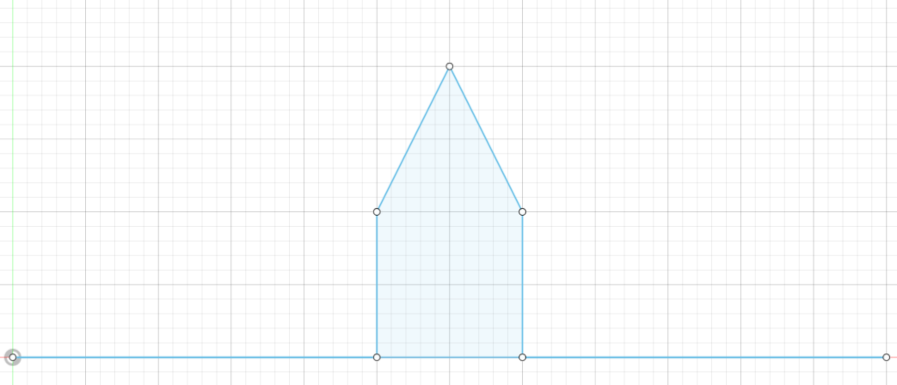
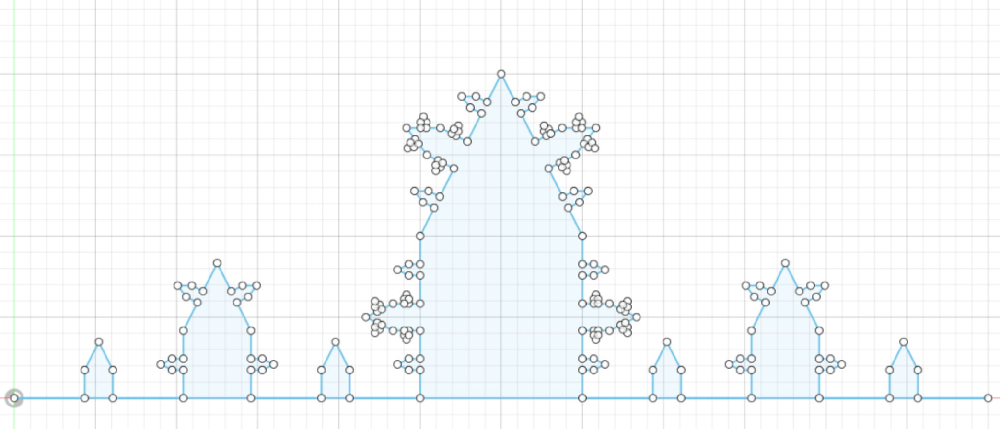
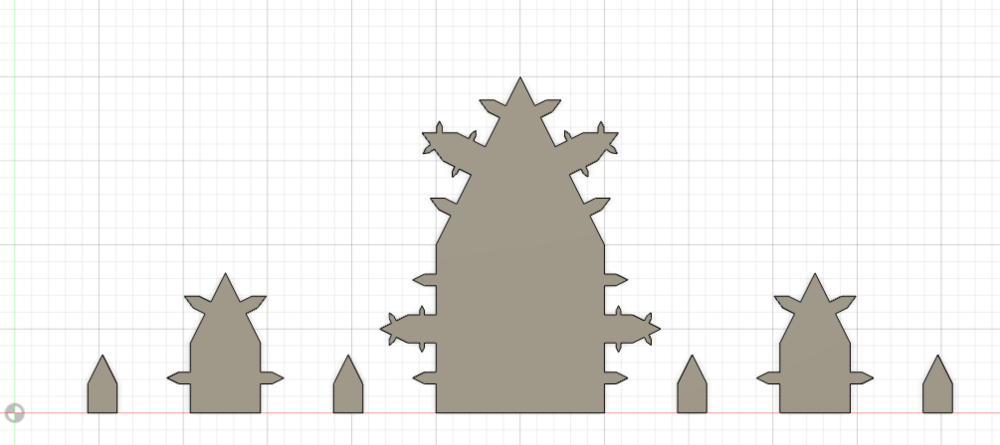

# (Space-filling) Fractal script based on hard-coded values.
Based on: https://youtu.be/RU0wScIj36o

## NOTE: This is a very slow solution to this problem that only works in 2D. Will build an updated one in the future.

## OVERVIEW:
The script creates a new sketch on the XY-plane and uses the create_fractal_lines() function to generate a fractal, based on a seed. The seed is currently a hardcoded value which is a list of points. The script will draw lines in the same order as they were appended to the list.

Running the script as uploaded will call create_fractal_lines() with 2 repetitions of the original seed.

## HOW TO CREATE YOUR FRACTAL:
In the "def run(context):" function you will find the hard-coded seed and number of repetitions being executed.

To specifically see only the seed set the number of repetitions to 0.

Feel free to change points values around that are appended to the list of "points".
The formatting to follow is: points.append(adsk.core.Point3D.create(X, Y, 0))
Keep in mind each line will be created from the previous point in the list to the next point.

## HOW IT WORKS:
Treating each repetition as an event I used some linear algebra and recursion to achieve what I saw in the video.

There is a reference line defined for the seed which is from the first point and the last point. This line is used as the basis for the seed's points. For each repetition, we use the lines that are created from the seed points as an individual basis for each new repetition. A change of basis matrix is then calculated from the reference line to the new line and used to apply a transformation to each of the seed points. This is done for each of the lines on the seed and will treat each new repetition as the same process.

## EXAMPLE:
The seed looks like this. (Setting the number of repetitions to 0)
</img>
Running the script based on this seed and a repetitions of 2.
</img>
And finally extruding it slightly to make the details more visible.
</img>
